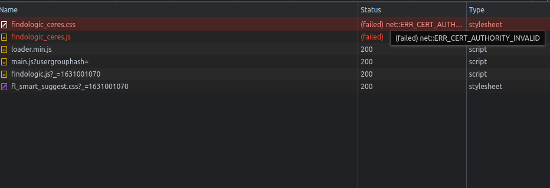
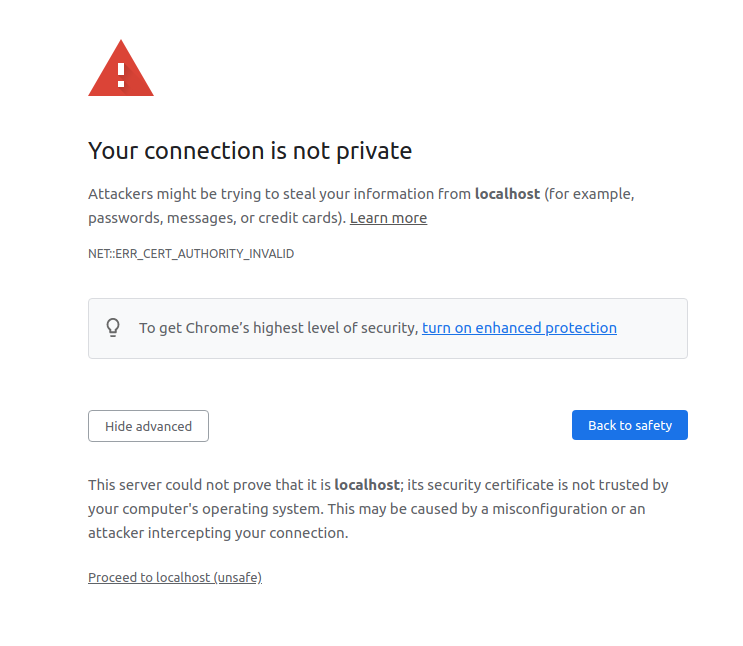

# Development Setup

## PlentyDevTool Installation

Before you can start developing, download the [PlentyDevTool](https://marketplace.plentymarkets.com/plenty-tools/plentydevtool_6652).
It is available for Windows, Linux and MacOS. This tool allows us to change files locally
and let Plenty update it for us automatically.

Start the downloaded program. If you run Linux, you may need to give it execution
permission with `chmod +x PlentyDevTool-1.1.5.AppImage`. Log in with your Plentymarkets credentials.


Create a new folder, where you will save all plugins from your plugin-sets. Something like
`~/Documents/plentyDevTool` should be sufficient. Select this folder in your PlentyDevTool.


In the Plentymarkets Backend create a new Plugin-Set that **only** contains **Ceres** and **IO**.
This Plugin-Set **must not be linked with any store**, otherwise automatic deployment **does not work**.


Back in the PlentyDevTool go to the *Dashboard* and *Reload* the Plugin-Set list.


On the left side open your Plugin-Set and check the *Ceres* and *IO* plugin and then click on *Pull*.
The initial pull may take some time, feel free to get a ☕ coffee in the meantime.


Now that everything is setup, clone this repo inside of the Plugin-Set path.
The path may be `~/Documents/plentyDevTool/34185/2`. The cloned repository name
**must be Findologic**, otherwise will not be recognized by the PlentyDevTool.

```bash
git clone git@github.com:findologic/plugin-plentymarkets-ceres-api.git Findologic
```

Now clicking *Detect new local plugins* in the PlentyDevTool should show the
Findologic plugin in the list. Click *Install*, which will upload your local plugin.


Refresh the Plugin-Sets in the PlentyDevTool and ensure to check the *Findologic* plugin
now and uncheck *Ceres* and *IO*. This tells Plentymarkets to only check for file
changes in the Findologic plugin.

Next refresh the Plugin-Set page in the browser and activate the newly added Findologic
plugin. Follow the [configuration instructions](https://docs.findologic.com/doku.php?id=integration_documentation:plentymarkets_ceres_plugin:ceres_plugin_configuration)
in our documentation and deploy the Plugin-Set.


When files are now changed, the PlentyDevTool will automatically detect them and allow you to
push your changes. Once pushed Plentymarkets will automatically trigger a build, that only
builds your changes, which makes it an almost immediate change.
From the [PlentyDevTool description](https://marketplace.plentymarkets.com/en/plentydevtool_6652):

> Warning:
> The auto build is an abbreviated build. It only checks the files changed, but does not validate how
> they interact with other files. Consequently, the auto build may not show errors that would become
> apparent in the manual build.


## Using Local Web Server With HMR

When working on Vue components it is easier to spin up a local development server,
which avoids the need of running a build each time a single line of code has been changed.
This also allows the browser to immediately react to any changes made, by utilizing HMR.

### Generate SSL Certificates

Before starting, please generate some local SSL certificates, as the webshop is typically hosted
on HTTPS and therefore, we need a self-signed SSL certificate in order to allow JS and CSS files
to be loaded from our local system.

```bash
openssl genrsa -out private.key 4096
openssl req -new -sha256 -out private.csr -key private.key
openssl x509 -req -days 3650 -in private.csr -signkey private.key -out private.crt -extensions req_ext
openssl x509 -in private.crt -out private.pem -outform PEM
```

### Start Local Web Server

There is already a predefined task in the `package.json`, which allows us to simply start the server
without having to specify where the SSL certificates are. The command will automatically start
a webserver at http://localhost:8080/.

```bash
npm run serve
```

### Serving Files Locally

1. Load CSS from local environment, by replacing the current stylesheet with the local one in
`resources/views/content/styles.twig`:
   ```html
   <link rel="stylesheet" href="https://localhost:8080/findologic_ceres.css" />
   ```
2. Load JS from local environment, by replacing the current script tag with the local one in
`resources/views/content/scripts.twig`:
   ```html
   <script src="https://localhost:8080/findologic_ceres.js"></script>
   ```

Upload these changes using the PlentyDevTool.

### Trust Self-Signed Certificates In The Browser

If the last step was done correctly, the files should now be tried to be loaded from your local system.



But they fail to load, as the authority is invalid. To fix this, simply right click and open in a new tab.
click on *Advanced* and *Proceed to localhost (unsafe)*.



This should be done for all files, including the HMR JS file. To be sure, simply check the Network Tab in
the DevTools.

Now refresh the page before, and you can begin developing 👍.
