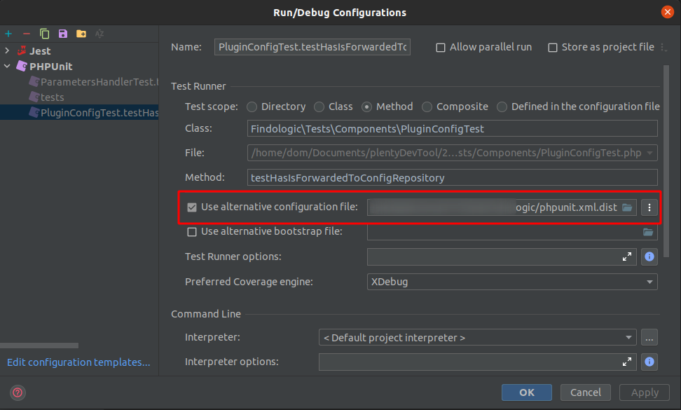

# Findologic API plugin for Plentymarkets Ceres
[](https://github.com/findologic/plugin-plentymarkets-ceres-api/actions/workflows/php.yml)

## Installation

### Prerequisites

Installation of Plentymarkets plugins:

* [Ceres](https://marketplace.plentymarkets.com/ceres_4697) >= 5.0.35
* [IO](https://marketplace.plentymarkets.com/io_4696) >= 5.0.35

### Install

For development install the Findologic plugin in the Plentymarkets backend via Git.
For production install the Findologic plugin via the [Plentymarkets marketplace](https://marketplace.plentymarkets.com/findologic_6390).

> Note: In the Plentymarkets Backend you have the possibility to change the code of your plugin but this only works if
the plugin has been installed via the marketplace.

## Development

Plentymarkets is a cloud hosted shop system, this means that it's not possible to setup on a local machine.
Create separate plugin sets in the Plentymarkets for development or debugging purposes.

### Running Unit-Tests

#### Prerequisites

* PHP >= 7.0 (>= 7.4 is not supported!)
* Composer >= 2.0
* Node: 14
* NPM: 7

#### PHPUnit

1. Install PHP dependencies
   ```bash
   composer install
   ```
2. Run PHPUnit tests
   ```bash
   composer test
   ```

Tests can also be run via the IDE manually. Ensure to set `phpunit.xml.dist` as alternative configuration file:


#### Jest component tests

1. Install NPM dependencies
   ```bash
   npm install
   ```
2. Run Jest tests
   ```bash
   npm run test
   ```

Tests can also be run via the IDE manually, without any additional configuration.

### Initial Development Setup

Please see [`DEV_SETUP.md`](DEV_SETUP.md) for an initial setup of the development environment.

### Building JS & CSS files

If you made any JS or CSS changes, always build them before pushing anything to the repository.

```bash
npm run build
```

## Deployment & Release
1. Update the German and English change logs in folder `meta/documents`.
1. Bump the plugin version in files `plugin.json` and `src/Constants/Plugin.php`.
1. Open the backend from our Plentymarkets shop.
1. Go to *Plugins > Plugin overview > Ceres > Findologic > Git* and fetch & pull the `main` branch.
1. Go back to *Plugin overview* and click *Save & deploy plugin set*.
1. Open the plugin again and click on *Upload to plentyMarketplace*.
1. The plugin may not be available yet, Plentymarkets has to do a review on their side.
1. After review was successful notify colleagues in #releases.

## Versioning

We use [SemVer](http://semver.org/) for versioning. For the versions available, see the [tags on this repository](https://github.com/findologic/plugin-plentymarkets-ceres-api/tags). 
